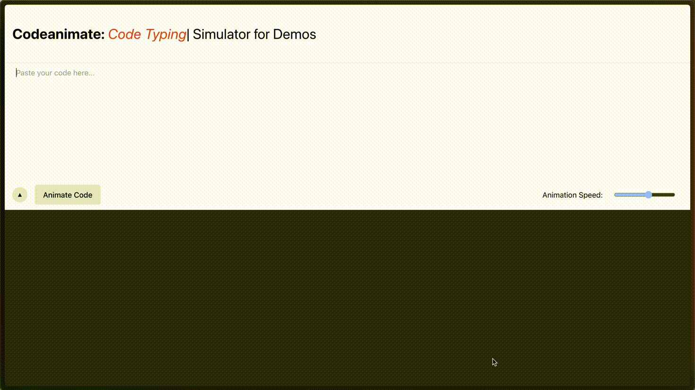

# [Codeanimate](https://codeanimate.pro)



**Codeanimate** is a powerful and user-friendly application that allows users to create beautiful typing animations of their code snippets. These animations are perfect for demos, tutorials, and presentations, helping to engage viewers and elegantly demonstrate coding workflows. 

> It is available [online here](https://codeanimate.pro)

The app supports exporting animations in both **GIF** and **MOV** formats.

## Features

- **Ease of Use**: Simply paste your code, choose your settings, and generate the animation.
- **Customization**: Select from multiple themes and typing speeds to match your presentation style.
- **Support for Multiple Formats**: Export your animations in GIF or MOV format to suit various platforms and needs.
- **Preview**: Instantly preview your animation before exporting to ensure it meets your expectations.

## Usage

To use Codeanimate, you can either visit the [live version](https://codeanimate.pro) or set it up locally:

1. **Start the Application**: Launch Codeanimate after installation.
2. **Input Code**: Paste the code snippet you wish to animate in the designated input area.
3. **Customize**: Select your preferred theme, typing speed, and output format.
4. **Generate Animation**: Click on 'Generate' to create your animation.
5. **Preview and Export**: Preview the animation and if satisfied, export it in the desired format.


## Dev Setup

Codeanimate requires [Node.js](https://nodejs.org/) to run locally.

```bash
# Clone this repository
git clone https://github.com/khushxxii/codeanimate.git

# Go into the repository
cd codeanimate

# Install dependencies
npm install

# Run the app
npm start
```

## Contributing

Contributions are what make the open-source community such an amazing place to learn, inspire, and create. Any contributions you make are **greatly appreciated**.

1. Fork the Project
2. Create your Feature Branch (`git checkout -b feature/AmazingFeature`)
3. Commit your Changes (`git commit -m 'Add some AmazingFeature'`)
4. Push to the Branch (`git push origin feature/AmazingFeature`)
5. Open a Pull Request

## License

Distributed under the MIT License. See `LICENSE` for more information.